# 스프링 배치
- `일괄처리 애플리케이션` 
- 실시간으로 처리가 어려운 `대용량 데이터`를 다루며, 배치를 다룰 때 DB `I/O 성능 문제`와 `메모리 자원`의 효율성을 생각해야한다. 
- `인프런` `스프링 배치(정수원님)` - `Spring Boot 기반으로 개발하는 Spring Batch` 강의 듣고 정리 

## 핵심 패턴
- Read: DB, 큐, 파일 등에서 데이터 조회
- Process: 데이터 가공 
- Write: 데이터 쓰기

## 배치 시나리오
- 배치 프로세스를 주기적으로 커밋 
- 동시 다발적인 job의 배치 처리, `대용량 병렬 처리`
- `실패 후 수동 또는 스케줄링에 의한 재시작`
- `의존관계 step을 순차적으로 처리`

## 스프링 배치 초기화 설정 클래스 
- `BatchAutoConfiguration` 
  + 스프링 배치가 초기화 될 때 자동으로 실행되는 설정 클래스 
  + Job을 수행하는 JobLauncherApplicationRunner 빈 생성 
- `SimpleBatchConfiguration`
  + JobBuilderFactory와 StepBuilderFactory 생성
  + 스프링 배치의 주요 구성 요소 생성 - `프록시 객체`로 생성됨 
- `BatchConfigurerConfiguration` 
  + BasicBatchConfigurer
    - SimpleBatchConfiguration에서 생성한 프록시 객체의 실제 대상 객체를 생성하는 설정 클래스  
  + JpaBatchConfigurer
  + 사용자 정의 BatchConfigurer 인터페이스를 구현하여 사용할 수 있음. 

## 배치 적용하기 
- gradle 
  ``` 
  implementation 'org.springframework.boot:spring-boot-starter-batch'
  ```
- `@EnableBatchProcessing` 어노테이션 추가 
  ```
  @SpringBootApplication
  @EnableBatchProcessing
  public class SpringBatchApplication {

    public static void main(String[] args) {
        SpringApplication.run(SpringBatchApplication.class, args);
    }

  }
  ```
  
## 배치 맛보기 Hello Batch
  ```
  @RequiredArgsConstructor
  @Configuration
  public class HelloJobConfiguration {

    private final JobBuilderFactory jobBuilderFactory;
    private final StepBuilderFactory stepBuilderFactory;

    @Bean
    public Job helloJob() {
        return jobBuilderFactory.get("helloJob")
                .start(helloStep1())
                .next(helloStep2())
                .build();
    }


    @Bean
    public Step helloStep2() {
        return stepBuilderFactory.get("helloStep1")
                .tasklet(new Tasklet() {
                    @Override
                    public RepeatStatus execute(StepContribution contribution, ChunkContext chunkContext) throws Exception {

                        System.out.println("=========================");
                        System.out.println(" >> Hello Spring Batch!!");
                        System.out.println("=========================");

                        return RepeatStatus.FINISHED;
                    }
                })
                .build();
    }

    @Bean
    public Step helloStep1() {
        return stepBuilderFactory.get("helloStep2")
                .tasklet(new Tasklet() {
                    @Override
                    public RepeatStatus execute(StepContribution contribution, ChunkContext chunkContext) throws Exception {

                        System.out.println("=========================");
                        System.out.println(" >> Step2 Spring Batch!!");
                        System.out.println("=========================");

                        return RepeatStatus.FINISHED;
                    }
                })
                .build();
    }
  } 
  ```
- `Job`이 구동되면 `Step`을 실행하고 Step이 구동되면 `Tasklet`(작업내용)을 실행하도록 설정함

## 메타 테이블
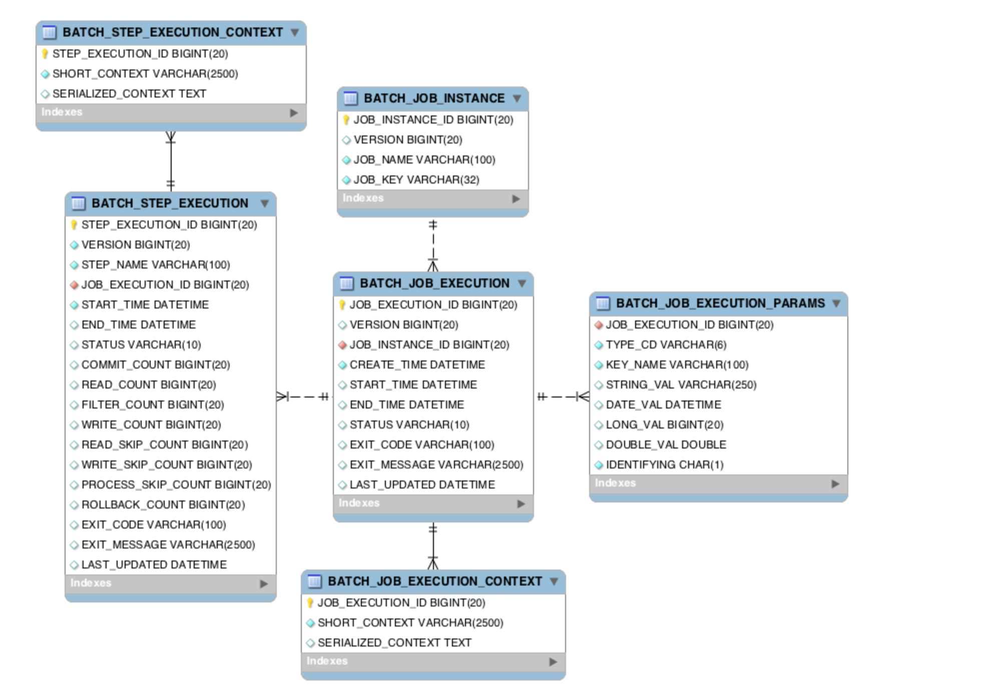
- 스프링 배치 실행 및 관리를 위해 `배치 실행 사항들을 DB에 저장`할 수 있음  
- 스키마 위치 `/org/springframework/batch/core/schema-*.sql`
- 기본으로 `h2같은 embedded db를 사용하면 테이블이 자동으로 생성` 된다.
- `MySQL`을 사용하려면 `schema-mysql.sql`를 복사해서 테이블을 생성해야 한다.
- 테이블 생성 옵션. spring.batch.jdbc.initialize-schema
  + `ALWAYS`: 스크립트 항상 실행. RDBMS -> 내장 DB 순서로 실행
  + `EMBEDDED`: 내장 DB일 때 스키마 자동 생성 
  + `NEVER`: 스크립트 실행 안함. 내장 DB일 경우 스크립트 생성이 안되기 때문에 오류 발생
  
## Job 관련 테이블
### BATCH_JOB_INSTANCE
- Job이 실행될 때 JobInstance 정보가 저장. 최상위 역할.
- `JOB_NAME`, `JOB_KEY`를 키로 하나의 데이터가 저장 (중복 불가)

### BATCH_JOB_EXECUTION
- job의 실행 정보가 저장. 

### BATCH_JOB_EXECUTION_PARAMS
- job과 함께 실행되는 jobParameter 정보를 저장 

### BATCH_JOB_EXECUTION_CONTEXT
- job이 실행되는 동안 여러가지 상태 정보, 공유 데이터를 직렬화 해서 저장 
- step 간 서로 공유 가능 

## Step 관련 테이블
### BATCH_STEP_EXECUTION
### BATCH_STEP_EXECUTION_CONTEXT


## MySQL로 메타 테이블 관리 
### 디비 연결 
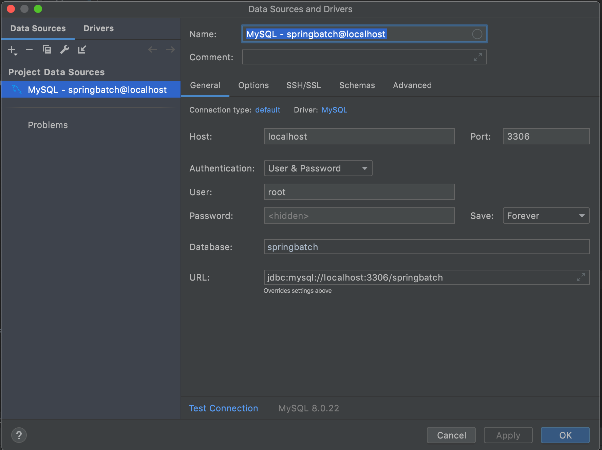
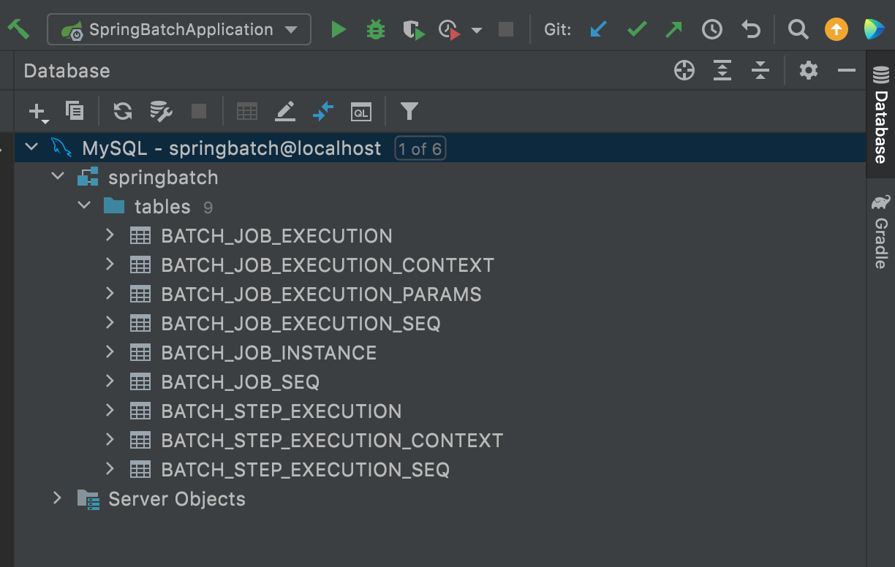

### application.yml 설정 
```
spring:
  profiles:
    active: mysql

---
spring:
  config:
    activate:
      on-profile: local
  datasource:
    hikari:
      jdbc-url: jdbc:h2:mem:testdb;DB_CLOSE_DELAY=-1;DB_CLOSE_ON_EXIT=FALSE
      username: sa
      password:
      driver-class-name: org.h2.Driver
  batch:
    jdbc:
      initialize-schema: embedded
---
spring:
  config:
    activate:
      on-profile: mysql
  datasource:
    hikari:
      jdbc-url: jdbc:mysql://localhost:3306/springbatch?useUnicode=true&characterEncoding=utf8
      username: root
      password: 1
      driver-class-name: com.mysql.cj.jdbc.Driver
  batch:
    jdbc:
      initialize-schema: always
```

# Job
- 배치 계층 구조에서 가장 상위에 있는 개념. 하나의 배치 작업 자체를 의미함. 
- 작업의 단위. 최상위 인터페이스. 
- `여러 Step을 포함하고 있는 컨테이너. 반드시 한개 이상의 Step으로 구성해야함.`

## Job 구현체 
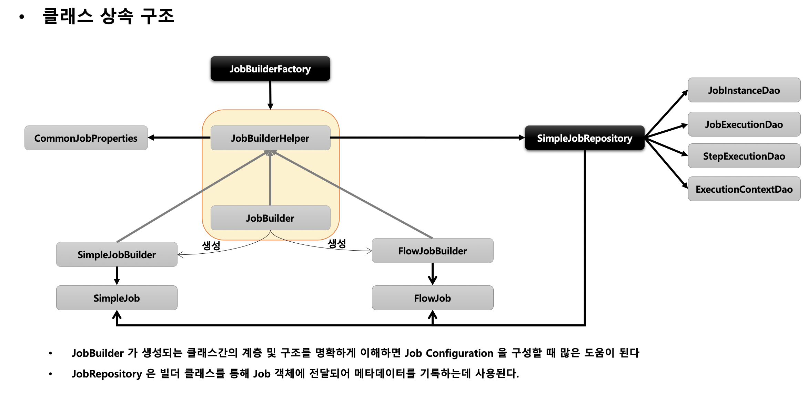 (출처: 인프런 스프링 배치(정수원) 강의 노트 중 일부분)
- `SimpleJob`
  + `순차적`으로 Step을 실행시키는 Job
  + 표준 기능
- `FlowJob`
  + `특정한 조건`과 흐름에 따라 Step을 구성하여 실행시키는 Job 
  + Flow 객체를 실행시켜서 작업을 진행 
  
# JobInstance, BATCH_JOB_INSTANCE
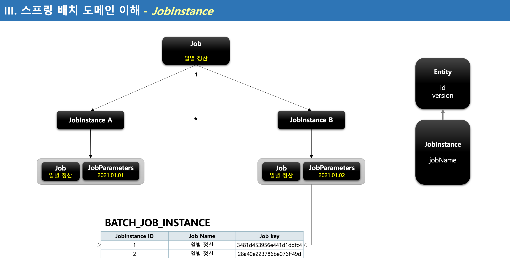 (출처: 인프런 스프링 배치(정수원) 강의 노트 중 일부분)
- `JobInstance`는 `Job이 실행될 때 생성`되고, `Job의 논리적 실행 단위`로서 작업 현황을 디비에 저장하는 메타데이터
- `Job`의 `설정과 구성은 동일해도 실행되는 시점에 처리하는 내용(Job, JobParameter)은 다르기 때문에 Job의 실행을 구분`해야한다. 
- 최초 실행하면 Job(jobName), JobParameter(jobKey) 정보가 JobInstance로 생성되어 JOB_INSTANCE 테이블에 저장된다.
  + 내부적으로 jobName + jobKey(jobParameter 해쉬값)으로 JobInstance 객체를 얻는다. 
- 이전과 동일한 정보인 경우 기존 JobInstance 정보를 얻는다. (동일한 내용으로는 수행 불가)  
- 즉, 똑같은 JobInstance는 하나밖에 없다. 

## BATCH_JOB_INSTANCE 실습
- 간단한 job을 만들어서 구동시켜보자.  
- ```java
  @Configuration
  @RequiredArgsConstructor
  public class JobConfiguration {
      private final JobBuilderFactory jobBuilderFactory;
      private final StepBuilderFactory stepBuilderFactory;
  
      @Bean
      public Job job() {
          return jobBuilderFactory.get("job")
                  .start(step1())
                  .build();
      }
  
      @Bean
      public Step step1() {
          return stepBuilderFactory.get("step1")
                  .tasklet(new Tasklet() {
                      @Override
                      public RepeatStatus execute(StepContribution contribution, ChunkContext chunkContext) throws Exception {
                          System.out.println("step1 was executed");
                          return RepeatStatus.FINISHED;
                      }
                  })
                  .build();
      }
  }
  ```
- BATCH_JOB_INSTANCE를 조회해보면 구동시킨 job 정보가 들어있다. 
- 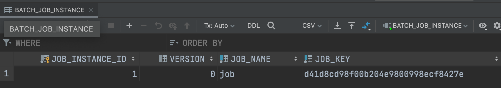
- `JOB_NAME`은 `jobBuilderFactory.get("job")`이고 `JOB_KEY`는 `jobParameters에 해시`를 적용한 값이다. 
- `job을 실행할 때 외부에서 파라미터 값을 받아서 jobParamter값으로 사용할 수 있다.`
- 배치를 다시 구동시켜보면, 데이터가 그대로인걸 볼 수 있다.
  + 위에 설명한 것처럼, `동일한 job에 대해서는 BATCH_JOB_INSTANCE에 기록되지 않는다.`

```
@Component
public class JobRunner implements ApplicationRunner {

    @Autowired
    private JobLauncher jobLauncher;

    @Autowired
    private Job job;

    @Override
    public void run(ApplicationArguments args) throws Exception {

        JobParameters jobParameters = new JobParametersBuilder()
                .addString("param", "test")
                .toJobParameters();

        jobLauncher.run(job, jobParameters);
    }
}
```
- 파라미터를 넘겨주기 위해서 `JobLauncher`로 job을 구동시켜보면 job, jobParameter 값이 기존에 없기에 JobInstance가 새로 생성된다.
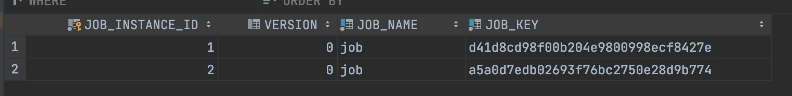
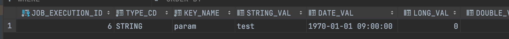

# JobParameter, BATCH_JOB_EXECUTION_PARAM 
- Job을 실행할 때 사용되는 파라미터
- JobInstance를 구분하기 위한 용도 
- `JobParamters와 JobInstance`는 `1:1 관계`
- 파라미터 타입은 String, double, date, long 이다.  

## 생성 및 바인딩 
- 어플리케이션 실행 시 주입
  + `java -jar spring-batch-0.0.1-SNAPSHOT.jar stringParam=test2 longParam(long)=2L`
- 코드로 생성
  + JobParameterBuilder, DefaultJobParametersConverter
  + ```
    JobParameters jobParameters = new JobParametersBuilder()
                .addString("stringParam", "test")
                .addLong("longParam", 1L)
                .toJobParameters(); 
    ```
- SpEL 이용 
  + @Value("#{jobParameters[datetime]}"), @JobScope, @StepScope 선언 필수 
- 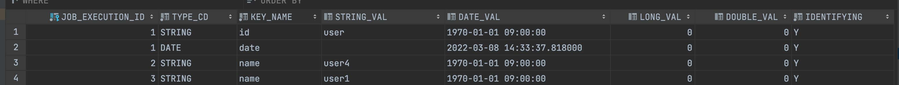

# JobExecution, BATCH_JOB_EXECUTION
- `JobInstance`를 `한 번 시도` 하는 것을 의미하는 객체. Job 실행 중에 발생한 정보들을 저장하는 객체 
- JobInstance 와 JobExecution 는 1:M 의 관계로서 JobInstance 에 대한 성공/실패의 내역을 가지고 있음
- `status`에는 `FAILED` or `COMPLETED`의 상태가 있음. 
- `status가 COMPLETED 상태가 될 때까지 동일한 JobParameter의 JobInstance를 여러 번 시도할 수 있음.` 

## BATCH_JOB_EXECUTION 실습 
- 최초 `Job`을 만들어서 `파라미터를 name=user1`로 전달하여 돌려보면 다음과 같다.
- ```java
  @Configuration
  @RequiredArgsConstructor
  public class JobExecutionBatch {
    private final JobBuilderFactory jobBuilderFactory;
    private final StepBuilderFactory stepBuilderFactory;

    @Bean
    public Job job() {
        return jobBuilderFactory.get("job")
                .start(step1())
                .build();
    }

    @Bean
    public Step step1() {
        return stepBuilderFactory.get("step1")
                .tasklet((contribution, chunkContext) -> {
                        System.out.println("job execution step1 was executed");
                        return RepeatStatus.FINISHED;
                })
                .build();
    }
  }
  ```
- 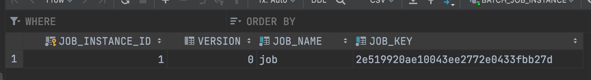
- 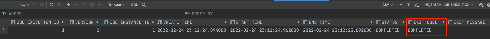
- status=`COMPLETED`로 되어있다.
- 여기서 재구동하면 동일한 job instance가 존재하니, 파라미터를 바꾸라는 에러가 뜬다.  
- 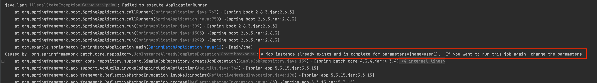
- 이번엔 스텝에 에러를 추가해보자. `next(step2())`, `파라미터를 name=user2`로 전달.
- ```
    @Bean
    public Job job() {
        return jobBuilderFactory.get("job")
                .start(step1())
                .next(step2())
                .build();
    }

    @Bean
    public Step step1() {
        return stepBuilderFactory.get("step1")
                .tasklet((contribution, chunkContext) -> {
                        System.out.println("job execution step1 was executed");
                        return RepeatStatus.FINISHED;
                })
                .build();
    }

    @Bean
    public Step step2() {
        return stepBuilderFactory.get("step2")
                .tasklet((contribution, chunkContext) -> {
                    System.out.println("job execution step2 was executed");
                    throw new RuntimeException("step2 has failed");
                })
                .build();
    }  
  ```
- 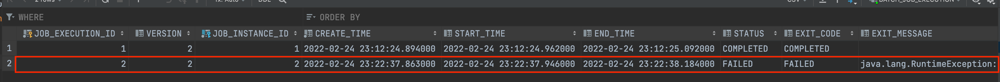
- 실행시켜보면 status=`FAILED`로 저장되어있다. 
- 이때 다시 실행시켜보자. 
- 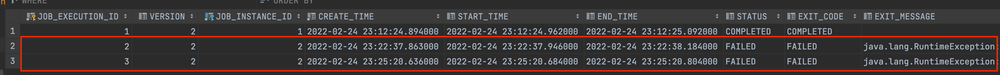
- COMPLETED이 아닌 FAILED로 끝났기 때문에 동일한 job과 파라미터로 시도해도 데이터가 추가된다. 
- step2()에 exception 부분을 return RepeatStatus.FINISHED로 바꾸고 실행시켜보자. 
- 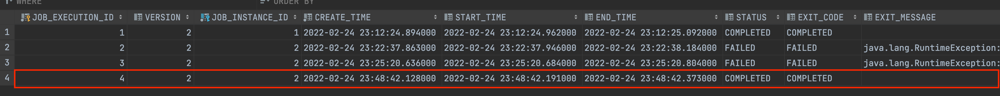
- 이번엔 `FAILED` 대신에 `COMPLETED`로 바뀌어있다. 
- COMPLETED일때 다시 실행시켜보면 `A job instance already exists and is complete for parameters={name=user2}.  If you want to run this job again, change the parameters.` 에러가 발생한다.   
- `즉, 동일한 job, jobParameters에 대해서 성공하면 다음번에 실행이 안되고, 실패하면 job_execution에 계속 추가되어 계속 시도한다.` 


# Step
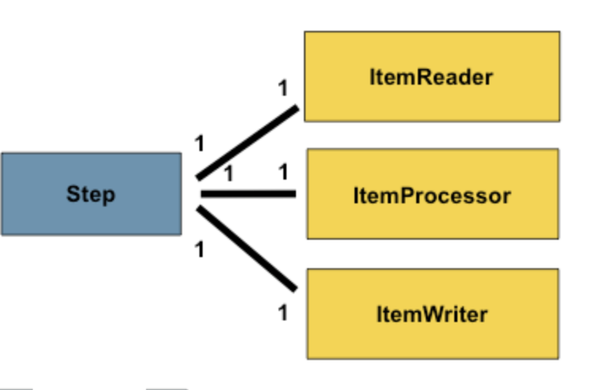
- Job을 구성하는 독립적인 하나의 단계
- 입력, 처리, 출력과 관련된 실제 비즈니스 로직이 들어감 

## 기본 구현체 
- TaskletStep
  + 기본 클래스. Tasket 타입의 구현체들을 제어 
- PartitionStep
  + 멀티스레드 방식으로 Step을 여러개 분리해서 실행 
- JobStep
  + Step 내에서 Job을 실행 
- FlowStep
  + Step 내에서 flow를 실행 

# StepExecution
- `Step을 한 번의 시도`를 의미하는 객체로서 Step 실행 중에 발생한 정보들을 저장하는 객체
- Step이 시도될때 생성되고, 각 Step 별로 생성
- Job이 재시작 하더라도 이미 completed한 Step은 재실행 되지 않고 failed한 Step만 실행됨 
- Step이 하나라도 실패하면 JobExecution은 failed로 저장되고, 모든 Step이 성공하면 JobExecution은 completed로 저장된다.
- `JobExecution`과 `StepExecution`은 `1:M` 관계

## BATCH_STEP_EXECUTION
- step을 3개 갖는 job을 실행.  
- 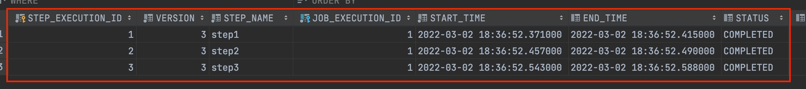
- 
- 실행 결과를 보면 step 3개가 completed고 JobExecution이 completed로 되어있음.
- 이번엔 step2에 에러를 발생시키고 파라미터 값을 바꿔서 실행 
- 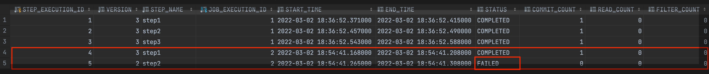
- 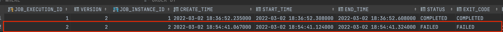
- 실행 결과를 보면, StepExecution step2 에서 FAILED가 발생했다. 실패한 step까지만 진행했고, step3는 진행되지 않은걸 볼 수 있다. JobExecution은 FAILED로 저장되어 있다.
  step2에 exception을 주석처리하고 return RepeatStatus.FINISHED로 바꾸서 다시 실행시켜보자.
- 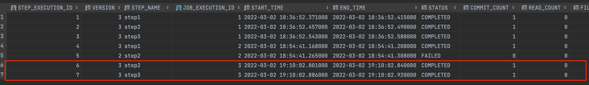
- 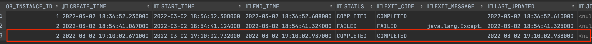
- 실행 결과를 보면, 실패한 step2부터 실행하여 나머지 step3까지 수행했다. JobExecution은 COMPLETED 로 저장되어 있다.
- `즉, 하나의 Job은 여러 개의 Step으로 구성되고, 도중에 Step이 실패하면 성공적으로 완료된 step은 재 실행되지 않고 실패한 step 만 실행된다.` 

# StepContribution
- `청크 프로세스 변경 사항을 저장해뒀다가(버퍼)` `apply` 메서드를 통해 `StepExecution에 상태`를 `업데이트` 하는 도메인 객체 
- ExitStatus는 사용자 정의하여 사용할 수 있음. 
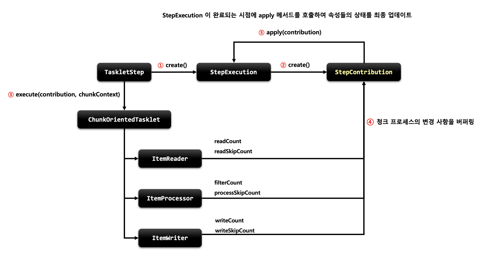 (출처: 인프런 스프링 배치(정수원) 강의 노트 중 일부분)

# ExecutionContext
- `StepExecution` or `JobExecution` 객체의 상태를 저장하는 `공유 객체` 
- 키/값으로 된 map 형태 
- StepExecution
  + 각 Step의 StepExecution에 저장되며 `Step 간 서로 공유 안됨`
- JobExeuction
  + 각 Job의 JobExecution에 저장되며 `Job간 서로 공유는 안되며` 해당 `Job의 Step간 서로 공유`됨 
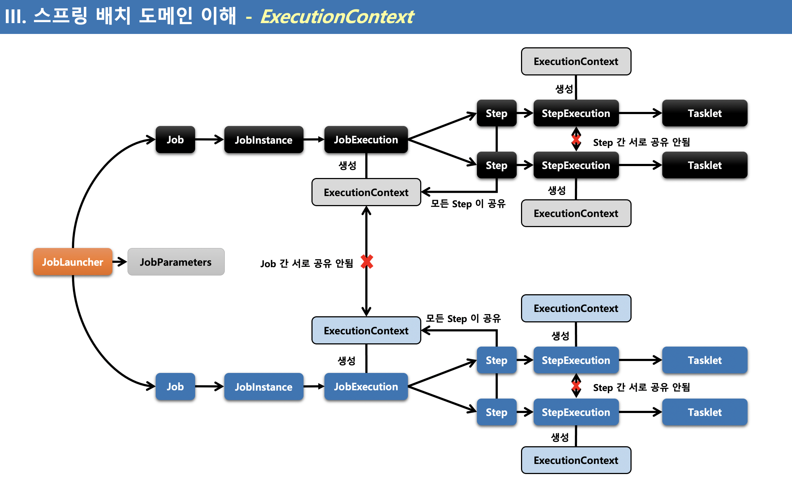 (출처: 인프런 스프링 배치(정수원) 강의 노트 중 일부분)

# JobRepository 
- `배치` 작업 중 정보를 저장하는 `메타 데이터`
- @EnableBatchProcessing 어노테이션을 선언하면 JobRepositroy가 빈으로 생성됨
- ```java
  @EnableBatchProcessing
  public class SpringBatchApplication {
    public static void main(String[] args) {
        SpringApplication.run(SpringBatchApplication.class, args);
    }
  }
  ```
- ```
  @Component
  @Slf4j
  public class JobRepositoryListener implements JobExecutionListener {

    @Autowired
    private JobRepository jobRepository;

    @Override
    public void beforeJob(JobExecution jobExecution) {

    }

    @Override
    public void afterJob(JobExecution jobExecution) {
        String jobName = jobExecution.getJobInstance().getJobName();
        JobParameters jobParameters = new JobParametersBuilder()
                .addString("name", "user4")
                .toJobParameters();


        JobExecution lastJobExecution = jobRepository.getLastJobExecution(jobName, jobParameters);
        if(lastJobExecution != null) {
            for(StepExecution execution : lastJobExecution.getStepExecutions()) {
                BatchStatus status = execution.getStatus();
                ExitStatus exitStatus = execution.getExitStatus();

                log.info("status = {}, exitStatus = {}", status, exitStatus);
            }
        }
    }
  }
  ```
- JobExecutionListener를 통해서 job이 끝날때 jobRepository 에서 배치 작업에 대한 정보를 이것 저것 볼 수 있다.

# JobLauncher
- 배치 Job을 `실행`시키는 역할 
- 실행시킬 때, `Job`, `JobParameters`가 인자로 필요함. 
- 스프링 부트에서는 JobLauncher 빈이 자동 생성되어 구동됨. 
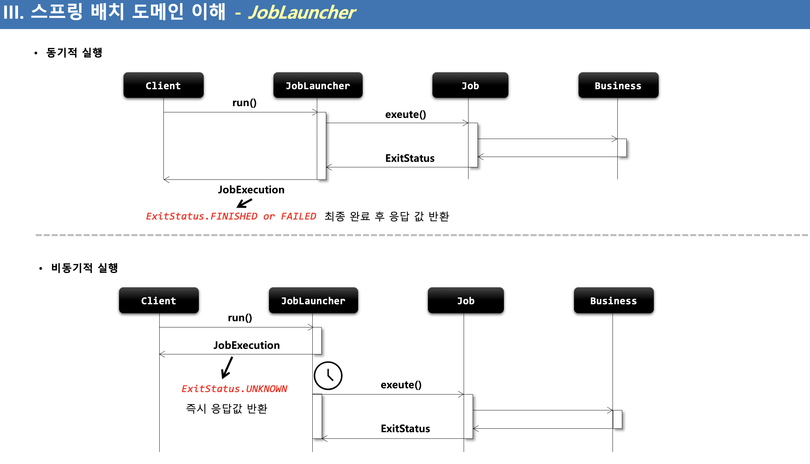 (출처: 인프런 스프링 배치(정수원) 강의 노트 중 일부분)
- `기본`은 SynckTaskExecutor로 `동기적`으로 실행되고, SimpleAsyncTaskExecutor를 사용하여 `비동기적으로 실행 가능` 


# JobBuilderFactory/ JobBuilder
## JobBuilderFactory
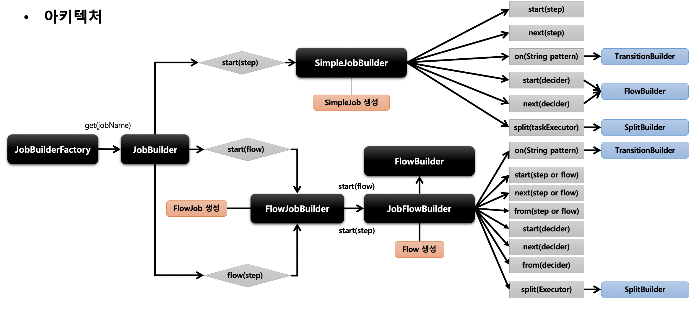
- JobBuilder를 생성하는 팩토리 클래스. 
- get 메서드 제공. jobBuilderFactory.get("job-test")

## JobBuilder
- `SimpleJobBuilder`
- `FlowJobBuilder`

# SimpleJob API 
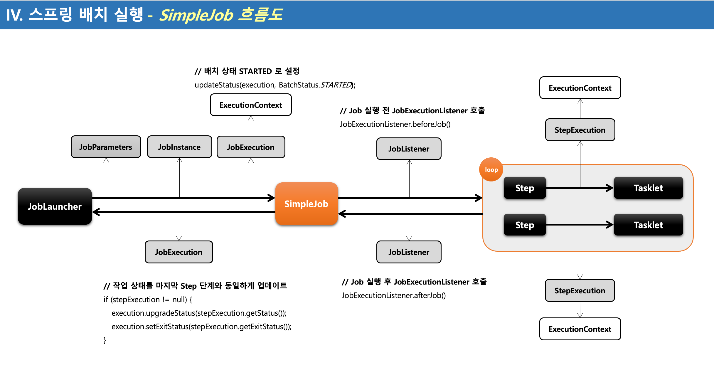 (출처: 인프런 스프링 배치(정수원) 강의 노트 중 일부분)
- SimpleJob은 Step을 실행시키는 Job의 구현체로서 SimpleJobBuilder에 의해 생성된다. 
- step을 순차적으로 실행시킨다. 
- ```
  public Job batchJob() {
      return jobBuilderFactory.get(“batchJob")
                .start(step1())
                .next(step2())
                .incrementer(JobParametersIncrementer)
                .preventRestart(true)
                .validator(JobParameterValidator)
                .listener(JobExecutionListener)
                .build();
  } 
  ```
- `start(step1())`는 처음 실행 할 Step 설정 
- `next(step2())`는 다음에 실행한 Step을 순차적으로 설정. 앞의 step이 실패하면 나머지 step은 진행하지 못함. 갯수 제한은 없음. 
- `incrementer(JobParametersIncrementer)`는 JobParameter의 값을 자동으로 증가해주는 설정. 
  + custom할 수  있고, new RunIdIncrementer()를 사용하면 매번 job을 실행시킬 수 있다. 
- `preventRestart(true)`는 재 시작 가능 여부 설정. false이면 실패여도 재시작 안함. default true
- `validator(JobParameterValidator)`는 JobParameter를 실행하기 전에 올바른 `파라미터 값`인지 `검증`하는 설정
  + custom할 수 있고, new DefaultJobParametersValidator를 이용해 key의 필수값과 옵션값을 지정할 수 있다. 
- `listener(JobExecutionListener)`는 Job 라이프 사이클의 특정 시점에 콜백 받을 수 있도록 제공 

# StepBuilderFactory/ StepBuilder
## StepBuilderFactory
- StepBuilder를 생성하는 팩토리 클래스.
- get 메서드 제공. StepBuilder.get("step-test")

## StepBuilder
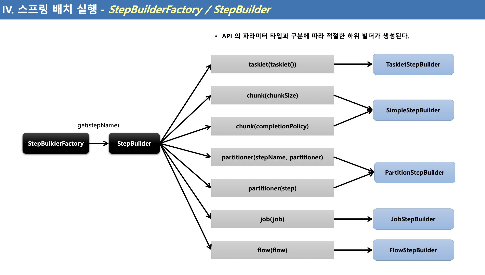 (출처: 인프런 스프링 배치(정수원) 강의 노트 중 일부분)
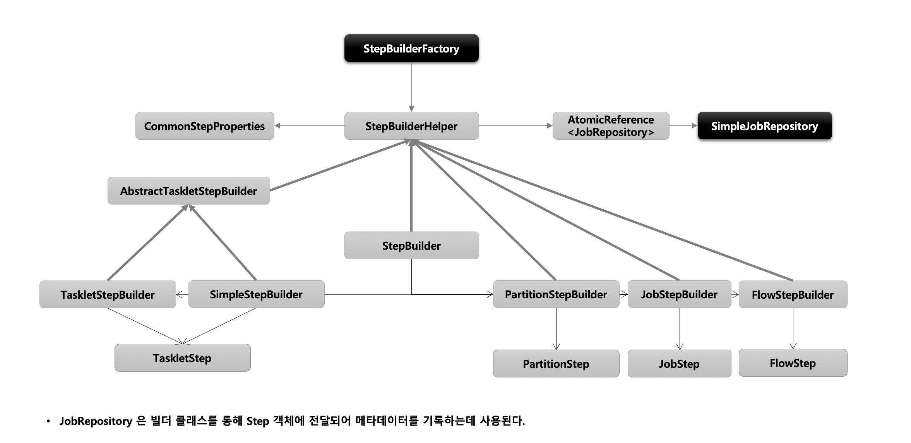 (출처: 인프런 스프링 배치(정수원) 강의 노트 중 일부분)
- [`TaskletStepBuilder`](#TaskletStep)
- `SimpleStepBuilder`
  + 청크기반 작업 처리
- `PartitionStepBuilder`
  + 멀티 스레드 방식으로 job 생성 
- [`JobStepBuilder`](#JobStep)
- [`FlowStepBuilder`](#FlowStep)

# TaskletStep. Task 기반, Chunk 기반
- ```
  public Step batchStep() {
        return stepBuilderFactory.get(“batchStep")
                .tasklet(Tasklet) // Task 기반
                //.<String, String>chunk(10) // Chunk 기반 
                .startLimit(10) 
                .allowStartIfComplete(true)
                .listener(StepExecutionListener)
                .build();
  }  
  ```
- `tasklet(Tasklet)`는 Tasklet 클래스 설정. 
- `startLimit(10)`는 Step의 실행 횟수를 설정. 초과시 오류 발생. 기본값은 INTEGER.MAX_VALUE 
- `allowStartIfComplete(true)`는 step의 성공, 실패와 상관없이 항상 Step을 실행시킴. 유효성 검증하는 step이나 사전 작업이 필요한 step에 적용
- `listener(StepExecutionListener)`는 라이프 사이클의 특정 시점에 콜백을 제공받도록 StepExecutionListener 설정

## Tasklet()
- `단일 태스크`를 수행하기 위한 것 
- TaskletStep에 의해 반복적으로 수행되며 반환값에 따라 계속 수행 혹은 종료함.
- ```
  return stepBuilderFactory.get(“batchStep")
  .tasklet((contribution, chunkContext) -> {
      System.out.println("job execution step1 was executed");
      return RepeatStatus.FINISHED;
  })
  ...
  .build();
  ```
- `RepeatStatus.FINISHED` - Tasklet 종료, RepeatStatus 을 null 로 반환해도 RepeatStatus.FINISHED로 해석
- `RepeatStatus.CONTINUABLE` - Tasklet 반복. 무한루프 주의


# JobStep
- `step안에 외부의 Job을 포함하고 있는 형태` 
- 외부의 job이 실패하면 해당 step이 실패하므로 결국 최종 job도 실패한다. 
- ```
  public Step jobStep() {
        return stepBuilderFactory.get("jobStep")
                .job(Job)
                .launcher(JobLauncher)
                .parametersExtractor(JobParametersExtractor)
                .build();
  }
  ```
- `job(job)`는 step 내부에서 실행될 job 설정
- `launcher(JobLauncher)`는 job을 실행할 jobLauncher 설정 
- `parametersExtractor(JobParametersExtractor)`는 Job이 실행되는데 필요한 jobParameters로 변환 


# FlowJob 
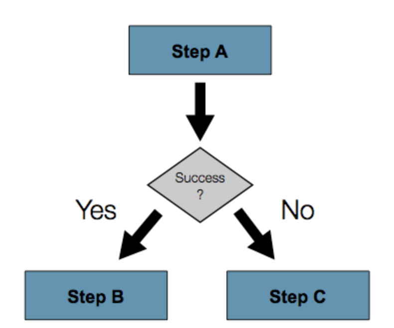 
- Step 처럼 순차적으로 실행하는 것이 아닌, `성공 실패에 따라 다른 수행을 진행해야할 때` 사용
  - stepA == success ? stepB : stepC
- Flow 내 Step의 마지막 ExitStatus 값이 FlowExecutionStatus로 저장되는데, 이는 최종 BatchStatus 값으로 반영  
- ```
  public Job batchJob() {
        return jobBuilderFactory.get(“batchJob")
                .start(Step1) //처음 실행할 flow 
                  .on(String pattern) //Step1의 종료 상태 매칭 패턴 
                  .to(Step2) //pattern이 만족되면 to(Step2)로 진행
                  .stop() / fail() / end() / stopAndRestart() //Step2 실행 후 Step의 종료 상태 transition 
                .from(Step1) //위에서 Step1 Transition을 이미 정의했는데 새롭게 Transition을 정의할 때 from() 사용 
                  .next(Step3) //다음으로 이동할 Step3
                .end() //종료 
                .build()
    }
  ```

## Transition 
- `Flow 내 Step의 조건부 전환`
- Step의 종료 상태(ExitStatus)가 어떤 pattern 과도 매칭되지 않으면 예외를 발생하고 job은 실패 
- transition은 구체적은 것부터 그렇지 않은 순서로 적용 
- on(), to(), stop(), fail(), end(), stopAndRestart()
### on(pattern)
- step의 실행 결과로 돌려받는 `종료 상태(ExitStatus)`와 매칭
- 일치하는 pattern이 없으면 예외가 발생하고 Job은 실패
### to() 
- 다음으로 실행할 단계 
### from() 
- 이전 단계에서 정의한 Transition을 새롭게 추가 정의
### stop(), fail(), end(), stopAndRestart()
+ stop(): BatchStatus, ExitStatus가 `STOPPED`로 종료
+ fail(): BatchStatus, ExitStatus가 `FAILED`로 종료
+ end(): BatchStatus, ExitStatus가 `COMPLETED`로 종료
+ stopAndRestart()
- ```
  public Job batchJob() {
        return jobBuilderFactory.get(“batchJob")
                .start(step1())  
                  .on("FAILED") //step1의 종료 상태가 FILED이면  
                  .to(step2()) //step2()를 실행 
                  .on("*") //step2()가 완료하면 stop()해라 
                  .stop() 
                .from(step1())
                  .on("*") //step1()의 종료 상태가 FAILED 외 일때  
                  .to(step3()) //step3()를 실행 
                  .next(step4()) //step3() 성공하면 step4()실행
                  .on("FAILED") //step4()가 FAILED면 end() 종료해라 
                  .end()
                .end() //종료 
                .build();
    }
  ```

## 사용자 정의 exitStatus
- ```
   @Bean
    public Job batchJob() {
        return this.jobBuilderFactory.get("batchJob")
                .start(step1())
                    .on("FAILED")
                    .to(step2())
                    .on("PASS") //step2()의 종료 코드가 PASS이면 stop 해라 
                    .stop()
                .end()
                .build();
    }
  
  @Bean
    public Step step2() {
        return stepBuilderFactory.get("step2")
                .tasklet((stepContribution, chunkContext) -> {
                    System.out.println("step2 has executed");
                    return RepeatStatus.FINISHED;
                })
                .listener(new PassCheckingListener())
                .build();
    }
  ```
- ```
  public class PassCheckingListener implements StepExecutionListener {
    @Override
    public void beforeStep(StepExecution stepExecution) {

    }

    @Override
    public ExitStatus afterStep(StepExecution stepExecution) {
        String exitCode = stepExecution.getExitStatus().getExitCode();

        if(!exitCode.equals(ExitStatus.FAILED.getExitCode())) {
            return new ExitStatus("PASS");
        }
        return null;
    }
  } 
  ```
  
## JobExecutionDecider 
- ExitStatus를 조작하거나 StepExecutionListener를 등록할 필요 없이 Transition 처리를 위한 전용 클래스. 역할과 책임을 나눔.  
- Step과 Transition 역할을 분리할 수 있음 
- ```
  public Job batchJob() {
        return this.jobBuilderFactory.get("batchJob")
                .incrementer(new RunIdIncrementer())
                .start(step())
                .next(decider()) //step()이 성공적으로 끝나면 decider()를 실행  
                .from(decider()).on("ODD").to(oddStep()) //decider() 결과가 ODD이면 oddStep() 실행
                .from(decider()).on("EVEN").to(evenStep()) //decider() 결과가 EVEN이면 evenStep() 실행
                .end()
                .build();
  } 

  @Bean
  public JobExecutionDecider decider() {
      return new CustomDecider();
  }
  ```
- ```
  @Override
  public FlowExecutionStatus decide(JobExecution jobExecution, StepExecution stepExecution) {
      count++;

      if (count % 2 == 0) {
          return new FlowExecutionStatus("EVEN");
      } else {
          return new FlowExecutionStatus("ODD");
      }
  }
  ```

# SimpleFlow API
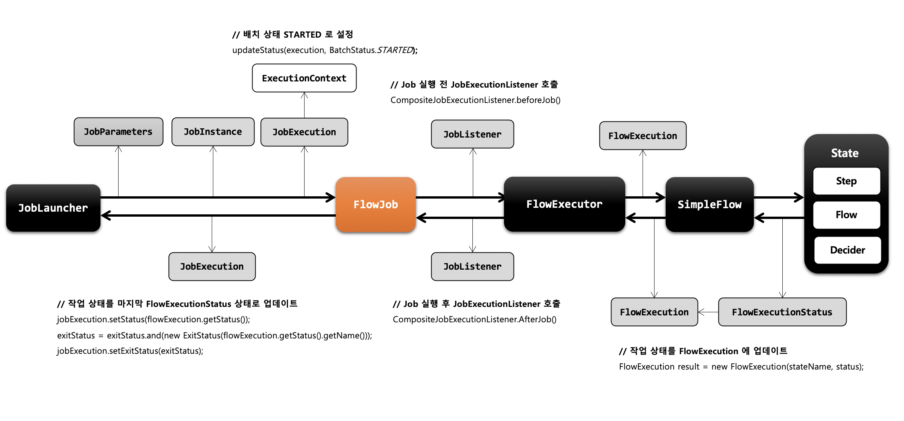 
- ```
  @Bean
  public Job batchJob() {
    return this.jobBuilderFactory.get("flowJob")
            .start(flow1())  //SimpleFlow
            .on("COMPLETED").to(step2()) //SimpleFlow
            .end()
            .build();
  }
  ```
- Flow 안에 Step을 구성하거나 Flow를 중첩되게 구성할 수 있다. 
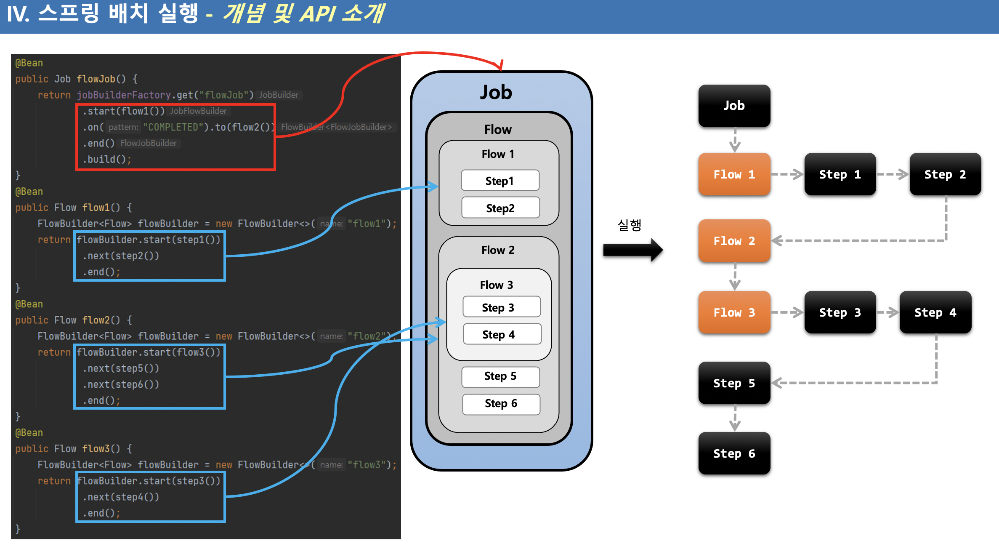 
- Flow는 Transition에 따라 State 객체를 생성하여 List<StateTransition>에 저장한다 
  + State에는 StepState, FlowState, DecisionState, SplitState가 있다. 
- StateTransition은 현재 실행할 state와 다음 실행할 state의 정보를 가지고있다. 
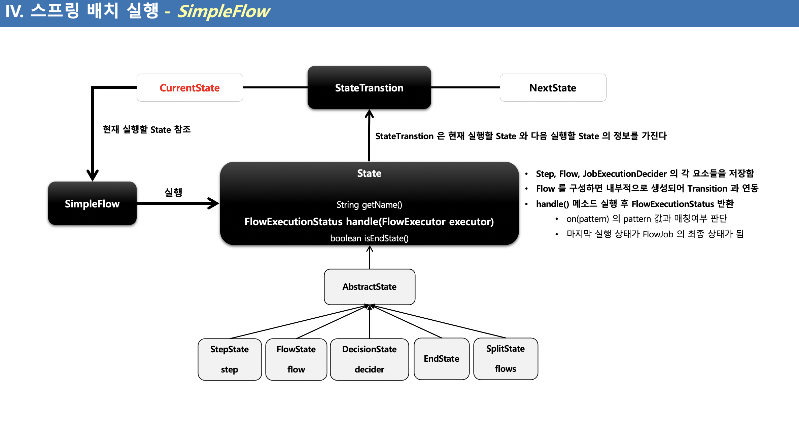 

# FlowStep
- step 내에 Flow를 할당하여 실행시키는 도메인 객체 
- flowStep의 BatchStatus와 ExitStatus는 Flow의 최종 상태값에 따라 결정 
- ```
  @Bean 
  public Step flowStep() {
      return stepBuilderFactory.get("flowStep")
              .flow(flow()) 
              .build();
  }

  @Bean
  public Flow flow() {
    FlowBuilder<Flow> flowBuilder = new FlowBuilder<>("flow");

    flowBuilder.start(step1())
            .next(step2())
            .end();

    return flowBuilder.build();
  }
  ```
- `flow(flow())`는 step 내부에서 실행 될 flow 설정.  

# @JobScope, @StepScope

## Scope
- 스프링 컨테이너에서 빈이 관리되는 범위 
- singleton, prototype, request, session, application 

## 스프링 배치 스코프 @JobScope, @StepScope
- Job과 Step의 빈 생성과 실행에 관여하는 스코프 
- 기본적으로 `프록시 모드`로 생성된다. 
  + `@Scope(value="job", proxyMode=ScopedProxyMode.TARGET_CLASS)`
- 해당 어노테이션이 있으면, `어플리케이션 구동 시점`이 아닌 `빈의 실행 시점`에 빈이 생성된다. 
- 따라서, `어플리케이션 실행 시점이 아니므로 Lazy Binding을 할 수 있는데 실행 시점에 Jobparameter를 넘겨줄 수 있다.` @Value("#{jobParameters[파라미터명]}")
- 또한 `병렬처리 시 각 스레드마다 할당되기 때문에 안전하게 실행할 수 있다.` 

## @JobScope
- ```
  @Bean
  public Job job() {
      return jobBuilderFactory.get("job")
              .start(step1(null))
              .build();
  }

  @Bean
  @JobScope
  public Step step1(@Value("#{jobParameters['message']}") String message) {
      System.out.println("message = " + message);
      return (stepContribution, chunkContext) -> {
            System.out.println("tasket1 has executed");
            return RepeatStatus.FINISHED;
  }
  ```
- `step` 구문에 `@JobScope`를 선언하고, `@Value`를 필수로 선언하여 사용한다. 
- 기존에 호출하던 부분에서는 null을 전달한다. `start(step1(null))`
- jobParameters인 message는 program arguments로 전달 //--job.name=job message=testScope

## @StepScope
- ```
  @Bean
  public Step step2() {
      return stepBuilderFactory.get("step2")
              .tasklet(tasklet2(null))
              .build();
  }

  @Bean
  @StepScope
  public Tasklet tasklet2(@Value("#{jobParameters['name']}") String name) {
      System.out.println("name = " + name);
      return (stepContribution, chunkContext) -> {
          return RepeatStatus.FINISHED;
      };
  }
  ```

# Chunk
- `chunk`는 `여러 개의 아이템을 묶은 하나의 덩어리`를 의미한다. 
- item을 하나씩 읽어와 chunk 단위의 덩어리로 만든 후 `chunk 단위로 트랜잭션`을 처리한다. 
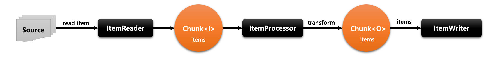
- ItemReader로 chunk size만큼 item을 하나씩 읽어와 Chunk<I>에 저장하고, Chunk<O>는 Chunk<I>를 적절하게 가공하여 ItemWriter에게 전달한다. 

## ChunkOrientedTasklet 
- chunk 지향 처리는 Tasklet의 구현체인 `ChunkOrientedTasklet`에서 담당한다. 
- TaskletStep에 의해 반복적으로 실행되고 `ChunkOrientedTasklet이 실행될 때마다 매번 새로운 트랜잭션` 처리가 이루어진다.
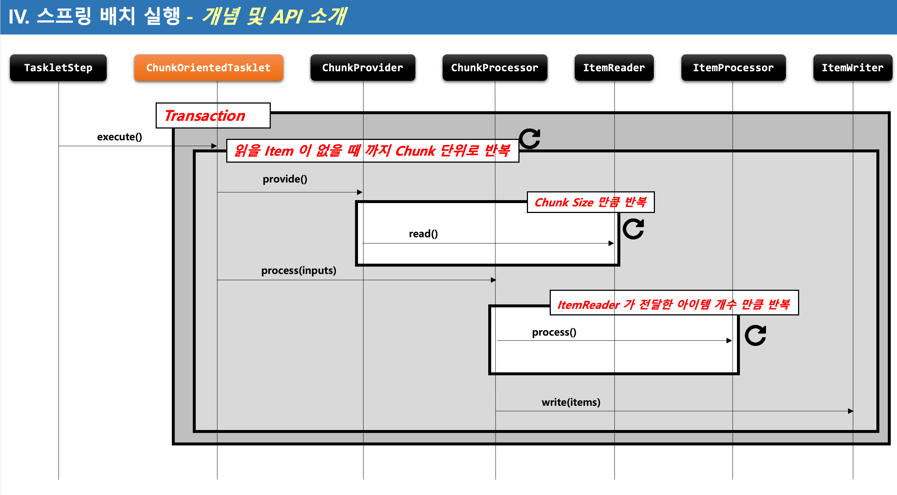
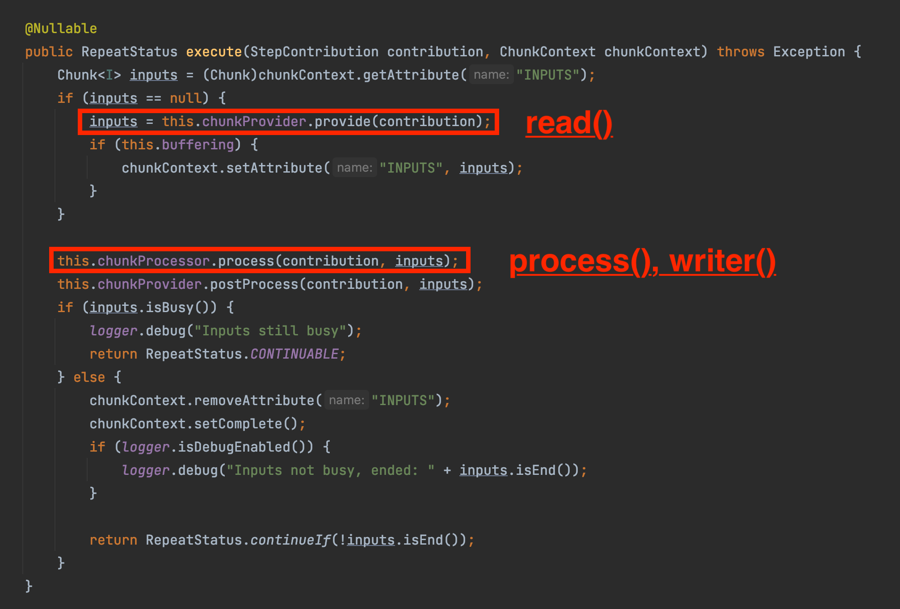
- `read()`로 `chunk size` 만큼 `item을 하나씩` 읽는다. 
- read한 데이터를 `chunk size` 만큼 반복하여 process() 한다.
- 가공된 items를 `한 번에 write` 한다. 
- 과정이 완료되면 트랜잭션은 커밋된다. 
- 과정 중 exception이 발생하면 해당 chunk는 롤백된다. 
- ```
  for(int i=0; i<totalSize; i+=chunkSize){ 
    List inputs = new Arraylist();
    for(int j = 0; j < chunkSize; j++){
        Object item = itemReader.read();
        inputs.add(item);
    }
    List outputs = new Arraylist();
    for(int j = 0; j < chunkSize; j++){
        Object output = itemProcessor.process(inputs.get(j));
        outputs.add(output);
    }
    itemWriter.write(outputs);
  }
  ```

### ChunkProvider 
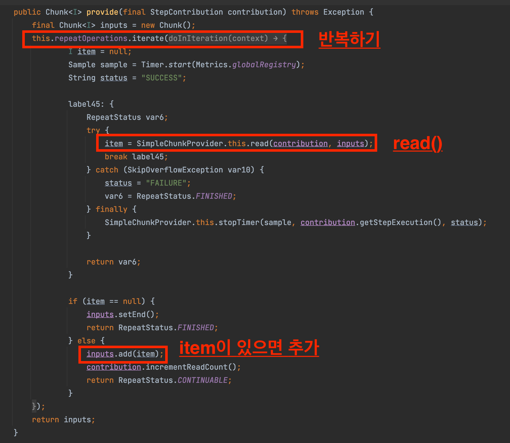
- ItemReader.read()로 chunk size 만큼 반복해서 item을 읽어서 Chunk<I>를 얻게된다. 
- `ChunkProvider가 호출될 때마다 새로운 chunk가 생성된다.` 
- chunk size 만큼 읽었거나 item == null 이면 해당 step이 종료된다. 

### ChunkProcessor 
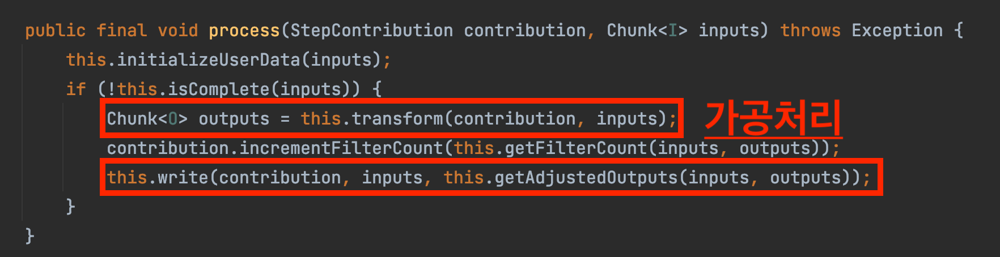
- `ItemProcessor로 item을 변형, 가공, 필터링하고 ItemWriter를 사용해 Chunk를 저장, 출력한다. `
- 앞서 얻은 Chunk<I>를 한 건씩 가공 처리하여 Chunk<O>에 저장한다. 
- process 처리가 완료되면 Chunk<O>의 items는 ItemWriter에게 전달된다. 

## 아키텍쳐 
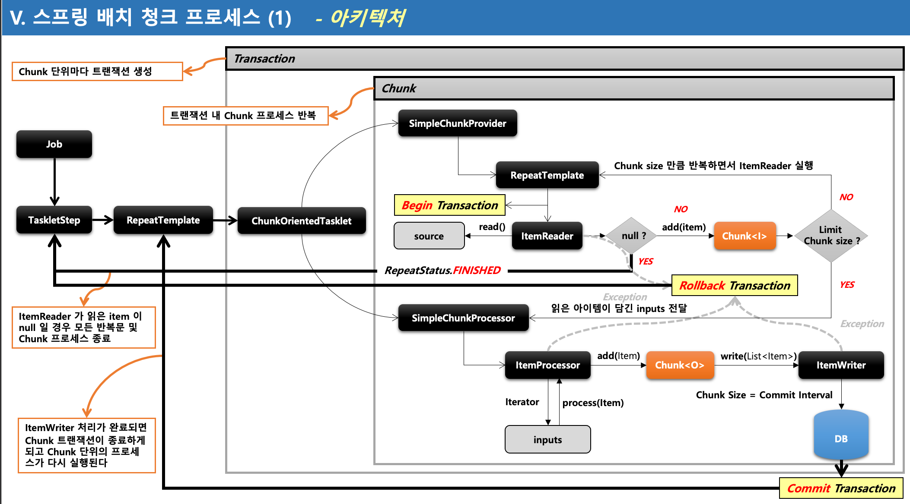

### 코드 구현
```
public Step chunkStep() {
  return stepBuilderFactory.get(“chunkStep")
    .<I, O>chunk(10)
    .<I, O>chunk(CompletionPolicy)
    .reader(itemReader())
    .writer(itemWriter())
    .processor(itemProcessor())    //optional
    .stream(ItemStream())
    .readerIsTransactionalQueue()
    .listener(ChunkListener)
    .build();
}

```
- `<I, O>chunk(10)` chunk size 설정. size 만큼 read -> process -> writer -> commit. `chunk size 만큼이 트랜잭션 단위`
- `reader(itemReader())` 소스로부터 item을 읽거나 가져오는 ItemReader 구현체 설정
- `writer(itemWriter())` item을 목적지에 쓰거나 보내기 위한 ItemWriter
- `processor(itemProcessor())` item을 변형. 필수값 아님 
- `stream(itemStream())` 재시작 데이터를 관리하는 콜백에 대한 스트림 
- `readerIsTransactionalQueue()` item이 MQ와 같은 트랜잭션 외부에서 읽혀지고 캐시할 것인지 여부. default false
- `listener(ChunkListener)` 특정 시점에 콜백 리스너 설정. 

# ItemReader

## FlatFileItemReader
- ```
  public FlatFileItemReader itemReader() {
    return new FlatFileItemReaderBuilder<T>()
      .name(String name)     // 이름 설정 
      .resource(Resource)	   // 읽을 리소스 설정 
      .delimited().delimiter("|") // 구분자로 파일 읽거나 
      .fixedLength()              // 고정된 길이로 파일 읽기 
      .addColumns(Range..)         // 고정 길이 지정 
      .names(String[] fieldNames)  // LineTokenizer로 구분된 라인을 객체의 필드명과 매핑
      .targetType(Class class)   
      .addComment(String Comment)
      .strict(boolean)             // 파싱에러가 날때 예외가 발생하지 않도록. default true
      .encoding(String encoding) 
      .linesToSkip(int linesToSkip)  // 상단에 무시할 라인 수 
      .saveState(boolean)   
      .setLineMapper(LineMapper)
      .setFieldSetMapper(FieldSetMapper)
      .setLineTokenizer(LineTokenizer)
    .build();
  }
  ```
- `resource`는 `ClassPathResource`나 `FileSystemResource` 등을 주로 사용한다. 

### DelimitedLineTokenize
- 한 개의 라인을 `구분자`로 나눠 `토큰화` 하는 방식
- ```
  @Bean
  public ItemReader delimiteditemReader() {
      return new FlatFileItemReaderBuilder<Customer>()
              .name("delimited")
              .resource(new ClassPathResource("/customer.csv"))
              .fieldSetMapper(new BeanWrapperFieldSetMapper<>())
              .linesToSkip(1)
              .delimited().delimiter(",")
              .names("name", "age", "year")
              .build();
  } 
  ```

### FixedLengthTokenizer 
- 한 개의 라인을 사용자가 설정한 `고정길이` 기준으로 나눠 `토큰화` 하는 방식 
- ```
  @Bean
  public ItemReader fixedLengthitemReader() {
      return new FlatFileItemReaderBuilder<Customer>()
              .name("fiexd")
              .resource(new ClassPathResource("/customer.csv"))
              .fieldSetMapper(new BeanWrapperFieldSetMapper<>())
              .linesToSkip(1)
              .targetType(Customer.class)
              .fixedLength()
              .addColumns(new Range(1, 4))
              .addColumns(new Range(5, 8))
              .addColumns(new Range(9, 11))
              .names("name", "age", "year")
              .build();
  } 
  ```
- 예를들어 한 라인을 읽었는데 0000BQWAabc라면, 0000, BQWA, abc로 토큰화된다. 

## JsonItemReader
- json 파싱을 위해 두 가지 구현체를 사용할 수 있다. JacksonJsonObjectReader, GsonJsonObejctReader
- ```
  @Bean
  public ItemReader jsonItemReader() {
      return new FlatFileItemReaderBuilder<Customer>()
              .name("json")
              .resource(new ClassPathResource("/customer.json"))
              .jsonObjectReader(new JacksonJsonObjectReader<>(Customer.class))
              .build();
  } 
  ```
- 내부적으로 ObjectMapper.readValue(JsonParser, Customer.class)로 파싱해서 읽는다. 


# DB Cursor Based & Paging Based
- `배치에서 실시간 처리가 어려운 대용량 데이터를 다룰 때, DB I/O의 성능 문제와 메모리 자원 문제를 고려해야 한다.`
## Cursor Based
- 데이터를 호출하면 현재 커서에서 다음 커서로 이동하여 데이터 반환이 이루어지는 `Streaming 방식의 I/O` 이다
- `배치가 완료`될 때까지 `DB 커넥션이 연결`되어 있으므로 `socketTimeout 시간`을 충분한 값으로 설정해야 함 
- 모든 결과를 메모리에 적재하기 때문에 `메모리 사용량이 많다.`


## Paging Based
- `페이징 단위로 데이터를 조회`하는 방식으로 `Page size` 만큼 `한 번에 메모리`로 가져온 다음 한 개씩 읽는다. 
- 한 페이지를 읽을 때마다 `커넥션을 맺고 끊기` 떄문에 대량의 데이터를 처리하더라도 `socketTimeout 예외가 거의 일어나지 않음.`. 
- 페이지 단위의 결과 만큼만 메모리에 할당하기 때문에 메모리 사용이 적다. 
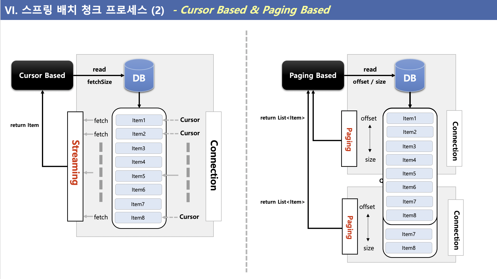

## JdbcCursorItemReader
- Cursor 기반의 JDBC 구현체로, ResultSet과 사용되며 Datasource에서 connection을 얻어와서 SQL을 실행
- `Thread 안정성이 보장되지 않음`. 멀티 스레드 환경에서 동시성 이슈가 발생할 수 있으므로 별도의 동기화 처리 필요. 
- ```
  @Bean
  public ItemReader<Customer> jdbcCursorItemReader() {
      return new JdbcCursorItemReaderBuilder<T>()
              .name("jdbcCursorItemReader")
              .fetchSize(chunkSize) // chunk size 와 동일하게
              .dataSource(dataSource)
              .sql(String sql)
              .beanRowMapper(Class<T>)
              .queryArguments(Object args)
              .maxItemCount(int count) //조회 할 최대 item 수
              .currentItemCount(int count) //조회 Item의 시작 지점 
              .maxRows(int maxRows) //ResultSet 오브젝트가 포함 할 수 있는 최대 행 수
              .build();
  }
  ```
- 보통 `fetchSize`는 `chunk size`와 동일하게 설정한다. 

## JpaCursorItemReader
- 스프링 배치 4.3부터 지원 
- cursor 기반의 JPA 구현체로서 EntityManagerFactory 객체가 필요하며 쿼리는 JPQL을 사용한다. 
- ```
  @Bean
  public ItemReader<Customer> jpaCursorItemReader() {
    return new JpaCursorItemReaderBuilder<Customer>()
          .name("jpaCursorItemReader")
          .entityManagerFactory(entityManagerFactory)
          .queryString(String JPQL)
          .parameterValues(Map<String, Object> parameters)
          .currentItemCount(int count) //조회 Item의 시작 지점 
          .maxRows(int maxRows) //ResultSet 오브젝트가 포함 할 수 있는 최대 행 수
          .build();
  }
  ```
- `JdbcCursorItemReader`는 itr.next()할 때마다 `직접 디비에서 데이터`를 하나씩 가져와 object로 변환하지만, `JpaCursorItemReader`는 이미 ResultStream에서 조회할 `데이터를 전부 갖고있고` itr.next()를 할 때 ResultStream에 있는 데이터를 하나씩 꺼내서 사용한다.

## JdbcPagingItemReader
- 스프링 배치에서 `page size`에 맞게 offset과 limit를 자동으로 생성하여 `페이지 단위로 쿼리를 생성`하여 데이터를 조회해준다. 
- 페이징 시 `order by` 구문이 필수로 필요하다. 
- 멀티 스레드 환경에서 `Thread-safe` 하다.
- 페이징 전략이 다르므로 `데이터 베이스 유형에 맞는 PagingQueryProvider를 사용`해야 한다. 
- ```
  @Bean
  public ItemReader<Customer> jdbcCursorItemReader() {
      return new JdbcPagingItemReaderBuilder<T>()
              .name("jdbcPagingItemReader")
              .pageSize(chunkSize) // 
              .dataSource(dataSource)
              .queryProvider(PagingQuqeryProvider)   //
              .rowMapper(Class<T>) // 쿼리로 반환 되는 데이터와 객체를 매핑
              .parameterValues(Map<String, Object> parameters)
              .maxItemCount(int count) //조회 할 최대 item 수
              .currentItemCount(int count) //조회 Item의 시작 지점 
              .maxRows(int maxRows) //ResultSet 오브젝트가 포함 할 수 있는 최대 행 수
              .selectClause(select) //PagingQuqeryProvider
              .fromClause(from)     //PagingQuqeryProvider
              .whereClause(where)   //PagingQuqeryProvider
              .groupClause(group)   //PagingQuqeryProvider
              .sortKeys(Map<String, Object> sortKeys) //PagingQuqeryProvider
              .build();
  }
  ```

## JpaPagingItemReader
- ```
  @Bean
  public JpaPagingItemReader jpaPagingItemReader() throws Exception {
      return new JpaPagingItemReaderBuilder<T>()
              .name("jpaPagingItemReader")
              .pageSize(size)
              .entityManagerFactory(entityManagerFactory)
              .queryString(JPQL)
              .parameterValues(Map<String, Object> parameters)
              .build();
  }
  ```

## ItemReaderAdapter 
- 이미 기존에 사용하고 있는 DAO나 서비스를 배치에서 사용하고 싶을 때 delegate 역할을 한다. 
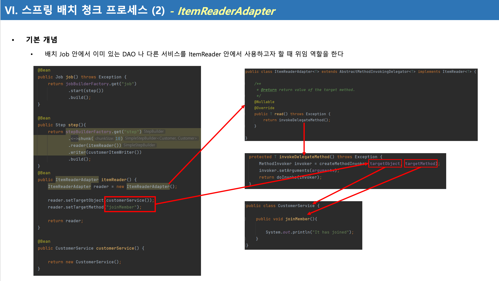