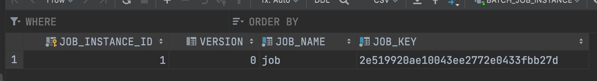
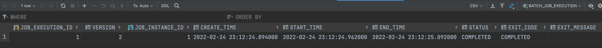
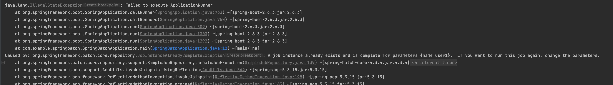
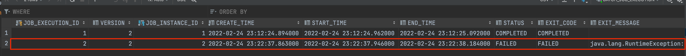
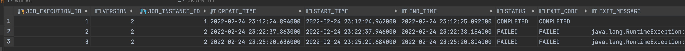
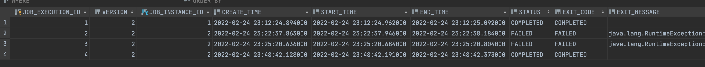

# 스프링 배치
- `일괄처리 애플리케이션` 
- `인프런` `스프링 배치(정수원님)` - `Spring Boot 기반으로 개발하는 Spring Batch` 강의 듣고 정리 

## 핵심 패턴
- Read: DB, 큐, 파일 등에서 데이터 조회
- Process
- Write

## 배치 시나리오
- 대용량 병렬 처리
- 실패 후 수동 또는 스케줄링에 의한 재시작
- 의존관계 step을 순차적으로 처리

## 스프링 배치 초기화 설정 클래스 
- `BatchAutoConfiguration` 
  + 스프링 배치가 초기화 될 때 자동으로 실행되는 설정 클래스 
  + Job을 수행하는 JobLauncherApplicationRunner 빈 생성 
- `SimpleBatchConfiguration`
  + JobBuilderFactory와 StepBuilderFactory 생성
  + 스프링 배치의 주요 구성 요소 생성 - `프록시 객체`로 생성됨 
- `BatchConfigurerConfiguration` 
  + BasicBatchConfigurer
    - SimpleBatchConfiguration에서 생성한 프록시 객체의 실제 대상 객체를 생성하는 설정 클래스  
  + JpaBatchConfigurer
  + 사용자 정의 BatchConfigurer 인터페이스를 구현하여 사용할 수 있음. 

## 배치 적용하기 
- gradle 
  ``` 
  implementation 'org.springframework.boot:spring-boot-starter-batch'
  ```
- `@EnableBatchProcessing` 어노테이션 추가 
  ```
  @SpringBootApplication
  @EnableBatchProcessing
  public class SpringBatchApplication {

    public static void main(String[] args) {
        SpringApplication.run(SpringBatchApplication.class, args);
    }

  }
  ```
  
## 배치 맛보기 Hello Batch
  ```
  @RequiredArgsConstructor
  @Configuration
  public class HelloJobConfiguration {

    private final JobBuilderFactory jobBuilderFactory;
    private final StepBuilderFactory stepBuilderFactory;

    @Bean
    public Job helloJob() {
        return jobBuilderFactory.get("helloJob")
                .start(helloStep1())
                .next(helloStep2())
                .build();
    }


    @Bean
    public Step helloStep2() {
        return stepBuilderFactory.get("helloStep1")
                .tasklet(new Tasklet() {
                    @Override
                    public RepeatStatus execute(StepContribution contribution, ChunkContext chunkContext) throws Exception {

                        System.out.println("=========================");
                        System.out.println(" >> Hello Spring Batch!!");
                        System.out.println("=========================");

                        return RepeatStatus.FINISHED;
                    }
                })
                .build();
    }

    @Bean
    public Step helloStep1() {
        return stepBuilderFactory.get("helloStep2")
                .tasklet(new Tasklet() {
                    @Override
                    public RepeatStatus execute(StepContribution contribution, ChunkContext chunkContext) throws Exception {

                        System.out.println("=========================");
                        System.out.println(" >> Step2 Spring Batch!!");
                        System.out.println("=========================");

                        return RepeatStatus.FINISHED;
                    }
                })
                .build();
    }
  } 
  ```
- `Job`이 구동되면 `Step`을 실행하고 Step이 구동되면 `Taskelt`(작업내용)을 실행하도록 설정함

## 메타 테이블

- 스프링 배치 실행 및 관리를 위해 배치 실행 사항들을 DB에 저장할 수 있음  
- 스키마 위치 `/org/springframework/batch/core/schema-*.sql`
- 기본으로 `h2같은 embedded db를 사용하면 테이블이 자동으로 생성` 된다.
- `MySQL`을 사용하려면 `schema-mysql.sql`를 복사해서 테이블을 생성해야 한다.
- 테이블 생성 옵션. spring.batch.jdbc.initialize-schema
  + `ALWAYS`: 스크립트 항상 실행. RDBMS -> 내장 DB 순서로 실행
  + `EMBEDDED`: 내장 DB일 때 스키마 자동 생성 
  + `NEVER`: 스크립트 실행 안함. 내장 DB일 경우 스크립트 생성이 안되기 때문에 오류 발생

## MySQL로 메타 테이블 관리 
- 디비 연결 


- application.yml 설정 
```
spring:
  profiles:
    active: mysql

---
spring:
  config:
    activate:
      on-profile: local
  datasource:
    hikari:
      jdbc-url: jdbc:h2:mem:testdb;DB_CLOSE_DELAY=-1;DB_CLOSE_ON_EXIT=FALSE
      username: sa
      password:
      driver-class-name: org.h2.Driver
  batch:
    jdbc:
      initialize-schema: embedded
---
spring:
  config:
    activate:
      on-profile: mysql
  datasource:
    hikari:
      jdbc-url: jdbc:mysql://localhost:3306/springbatch?useUnicode=true&characterEncoding=utf8
      username: root
      password: 1
      driver-class-name: com.mysql.cj.jdbc.Driver
  batch:
    jdbc:
      initialize-schema: always
```

### Job 관련 테이블 
- BATCH_JOB_INSTANCE
- BATCH_JOB_EXECUTION
- BATCH_JOB_EXECUTION_PARAMS
- BATCH_JOB_EXECUTION_CONTEXT

### Step 관련 테이블 
- BATCH_STEP_EXECUTION
- BATCH_STEP_EXECUTION_CONTEXT

# Job
- 배치 계층 구조에서 가장 상위에 있는 개념. 하나의 배치 작업 자체를 의미함. 
- 작업의 단위. 최상위 인터페이스. 
- 여러 Step을 포함하고 있는 컨테이너. 반드시 한개 이상의 Step으로 구성해야함.

## Job 구현체 
- `SimpleJob`
  + 순차적으로 Step을 실행시키는 Job
  + 표준 기능
- `FlowJob`
  + 특정한 조건과 흐름에 따라 Step을 구성하여 실행시키는 Job 
  + Flow 객체를 실행시켜서 작업을 진행 
  
# JobInstance
 (출처: 인프런 스프링 배치(정수원) 강의 노트 중 일부분)
- `JobInstance`는 `Job이 실행될 때 생성`되고, `Job의 논리적 실행 단위`로서 작업 현황을 디비에 저장하는 메타데이터
- `Job`의 `설정과 구성은 동일해도 실행되는 시점에 처리하는 내용(Job, JobParameter)은 다르기 때문에 Job의 실행을 구분`해야한다. 
- 최초 실행하면 Job(jobName), JobParameter(jobKey) 정보가 JobInstance로 생성되어 JOB_INSTANCE 테이블에 저장된다.
- 이전과 동일한 정보인 경우 기존 JobInstance 정보를 얻는다. (동일한 내용으로는 수행 불가)  
- 즉, 똑같은 JobInstance는 하나밖에 없다. 

## BATCH_JOB_INSTANCE
- 간단한 job을 만들어서 구동시켜보자.  
- ```java
  @Configuration
  @RequiredArgsConstructor
  public class JobConfiguration {
      private final JobBuilderFactory jobBuilderFactory;
      private final StepBuilderFactory stepBuilderFactory;
  
      @Bean
      public Job job() {
          return jobBuilderFactory.get("job")
                  .start(step1())
                  .build();
      }
  
      @Bean
      public Step step1() {
          return stepBuilderFactory.get("step1")
                  .tasklet(new Tasklet() {
                      @Override
                      public RepeatStatus execute(StepContribution contribution, ChunkContext chunkContext) throws Exception {
                          System.out.println("step1 was executed");
                          return RepeatStatus.FINISHED;
                      }
                  })
                  .build();
      }
  }
  ```
- BATCH_JOB_INSTANCE를 조회해보면 구동시킨 job 정보가 들어있다. 
- 
- `JOB_NAME`은 `jobBuilderFactory.get("job")`이고 `JOB_KEY`는 `jobParameters에 해시`를 적용한 값이다. 
- job을 실행할 때 외부에서 파라미터 값을 받아서 jobParamter값으로 사용할 수 있다.
- 위에 설명한 것처럼, `동일한 job에 대해서는 BATCH_JOB_INSTANCE에 기록되지 않는다.` 
- 배치를 다시 구동시켜보면, 데이터가 그대로인걸 볼 수 있다.
- 파라미터를 넘겨주기 위해서 `JobLauncher`로 job을 구동시켜보면 job, jobParameter 값이 기존에 없기에 JobInstance가 새로 생성된다. 
```
@Component
public class JobRunner implements ApplicationRunner {

    @Autowired
    private JobLauncher jobLauncher;

    @Autowired
    private Job job;

    @Override
    public void run(ApplicationArguments args) throws Exception {

        JobParameters jobParameters = new JobParametersBuilder()
                .addString("param", "test")
                .toJobParameters();

        jobLauncher.run(job, jobParameters);
    }
}
```
- 
- 

# JobParameter 
- Job을 실행할 때 사용되는 파라미터
- JobInstance를 구분하기 위한 용도 
- JobParamters와 JobInstance는 1:1 관계
- 파라미터 타입은 String, double, date, long 이다.  

## 생성 및 바인딩 
- 어플리케이션 실행 시 주입
  + `java -jar spring-batch-0.0.1-SNAPSHOT.jar stringParam=test2 longParam(long)=2L`
- 코드로 생성
  + JobParameterBuilder, DefaultJobParametersConverter
  + ```
    JobParameters jobParameters = new JobParametersBuilder()
                .addString("stringParam", "test")
                .addLong("longParam", 1L)
                .toJobParameters(); 
    ```
- SpEL 이용 
  + @Value("#{jobParameters[datetime]}"), @JobScope, @StepScope 선언 필수 

# JobExecution
- JobInstance를 한번 시도 하는 것을 의미하는 객체. Job 실행 중에 발생한 정보들을 저장하는 객체 
- JobInstance 와 JobExecution 는 1:M 의 관계로서 JobInstance 에 대한 성공/실패의 내역을 가지고 있음

## BATCH_JOB_EXECUTION
- 최초 Job을 만들어서 파라미터를 name=user1로 전달하여 돌려보면 다음과 같다.
- ```java
  @Configuration
  @RequiredArgsConstructor
  public class JobExecutionBatch {
    private final JobBuilderFactory jobBuilderFactory;
    private final StepBuilderFactory stepBuilderFactory;

    @Bean
    public Job job() {
        return jobBuilderFactory.get("job")
                .start(step1())
                .build();
    }

    @Bean
    public Step step1() {
        return stepBuilderFactory.get("step1")
                .tasklet((contribution, chunkContext) -> {
                        System.out.println("job execution step1 was executed");
                        return RepeatStatus.FINISHED;
                })
                .build();
    }
  }
  ```
- 
- 
- status=COMPLETED로 되어있다.
- 여기서 재구동하면 동일한 job instance가 존재하니, 파라미터를 바꾸라는 에러가 뜬다.  
- 
- 이번엔 step2()에 에러를 발생시켜 job에 next(step2())를 추가해보자. 파라미터를 name=user2로 전달.
- ```
    @Bean
    public Job job() {
        return jobBuilderFactory.get("job")
                .start(step1())
                .next(step2())
                .build();
    }

    @Bean
    public Step step1() {
        return stepBuilderFactory.get("step1")
                .tasklet((contribution, chunkContext) -> {
                        System.out.println("job execution step1 was executed");
                        return RepeatStatus.FINISHED;
                })
                .build();
    }

    @Bean
    public Step step2() {
        return stepBuilderFactory.get("step2")
                .tasklet((contribution, chunkContext) -> {
                    System.out.println("job execution step2 was executed");
                    throw new RuntimeException("step2 has failed");
                })
                .build();
    }  
  ```
- 
- 실행시켜보면 status=FAILED로 저장되어있다. 
- 이때 다시 실행시켜보자. 
- 
- COMPLETED로 끝난게 아니라 FAILED였기 때문에 데이터가 추가된걸 볼 수 있다. 
- step2()에 exception 부분을 return RepeatStatus.FINISHED로 바꾸고 실행시켜보자. 
- 
- 이번엔 FAILED대신에 COMPLETED로 바뀌어있다. 
- COMPLETED일때 다시 실행시켜보면 `A job instance already exists and is complete for parameters={name=user2}.  If you want to run this job again, change the parameters.` 에러가 발생한다.   
- 즉, 동일한 job, jobParameters에 대해서 성공하면 다음번에 실행이 안되고, 실패하면 job_execution에 계속 추가되어 계속 시도한다.   


